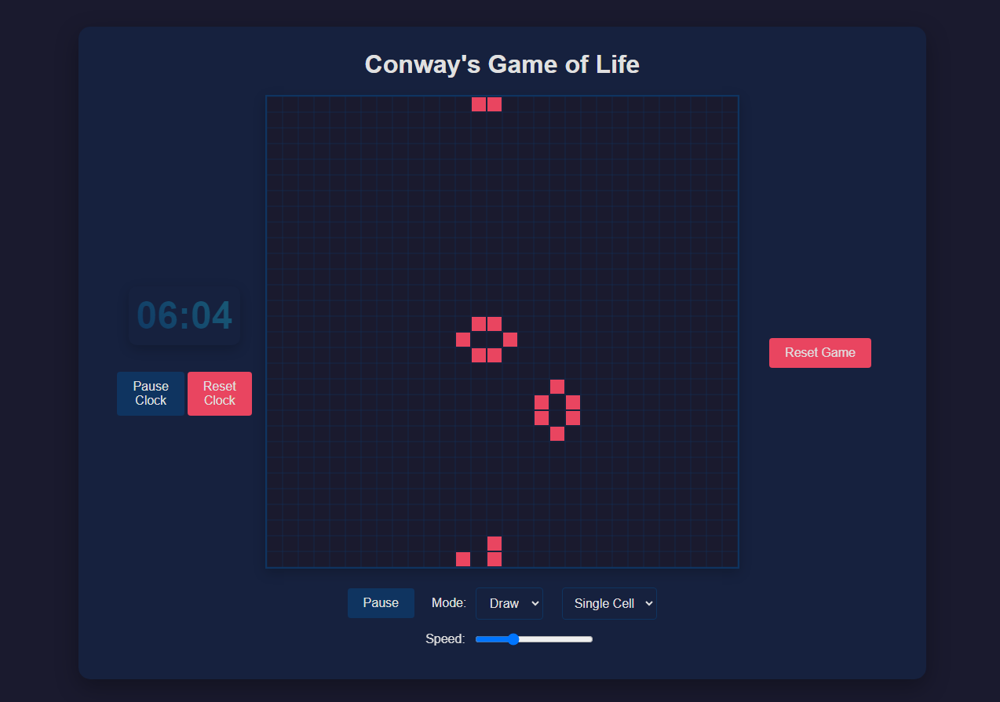

# Features

Interactive Grid: Draw and edit the initial configuration using a grid interface also you can draw patterns in a single click.
Control Panel: Pause, reset, and control the speed of the simulation.
Clock Integration: Includes a clock to keep track of the simulation time.

